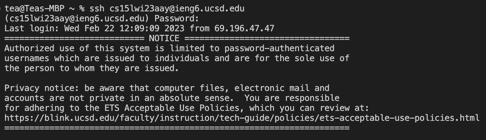
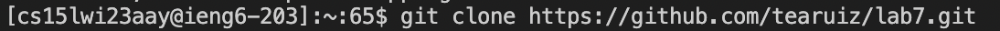
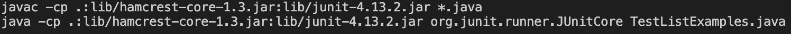
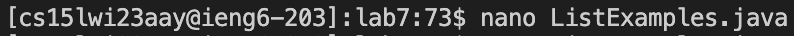
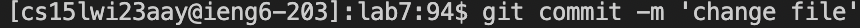
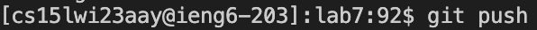

# Lab Report 4: Command Line Competition 
## Step 4: Log Into ieng6 
  * Logged into ieng6 using `ssh`
  
## Step 5: Clone My Fork
  * Made a fork of the repository from [https://github.com/ucsd-cse15l-w23/lab7](url)
  * Used the `git clone` command to clone the fork
  
## Step 6: Run the tests
  * I changed directories using `cd lab7`
  * Then I ran the `javac` and `java` commands to run the tests in the TestListExamples file
  
  * The message returned was test failing
## Step 7: Edit The Code File 
  * I used the `nano` command to open up the code file in the terminal
  
  * I then scrolled to the line with the error and fixed it
  * Keys Pressed: `<right>` 12 times and then `<backspace>` and changing index1 to index2
  * To save I used: `<Ctrl-O>` and `<enter>`
  * To exit: `<Ctrl-X>`
## Step 8: Run the tests to show success
  * Repeated Step 6
  * Keys pressed: `<Ctrl-C><Ctrl-V><enter><Ctrl-C><Ctrl-V><enter>`
    
## Step 9: Commit and push changes to github
  * Used `git commit -m 'message'` and `git push` 
  
  
  
