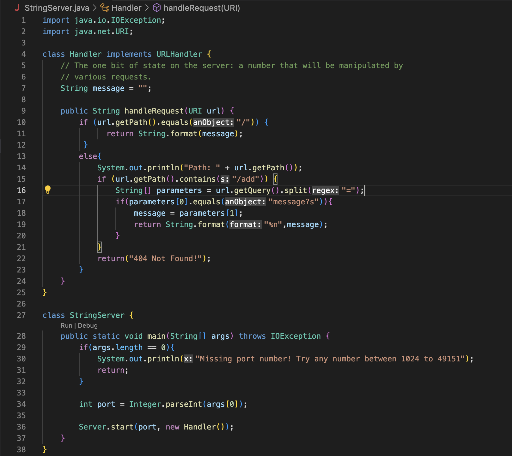
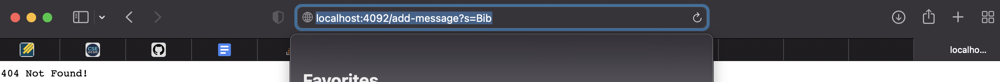
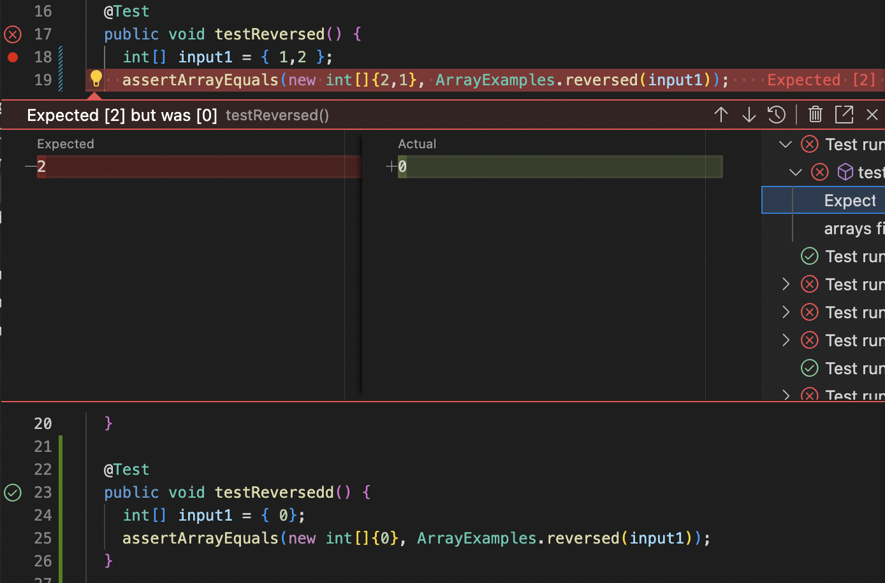

## Part 1: Building A Server 
My code for StringServer: 


Running path `/add-message?s=Bib`:

* This path led to a 404 error when it should have printed Bib. I am not sure what was wrong with my code,
I feel it has to do with how I have the code read the command. 

## Part 2: Bugs
The following code causes failure for the `reversed` method in the Array test:
```
public void testReversed() {
    int[] input1 = { 1,2};
    assertArrayEquals(new int[]{ 2,1}, ArrayExamples.reversed(input1));
  }
```

This input does not cause a failure to occur:
```
public void testReversed() {
    int[] input1 = { 0};
    assertArrayEquals(new int[]{0}, ArrayExamples.reversed(input1));
  }
```
The symptom:


The Bug:
```
for(int i = 0; i < arr.length; i += 1) {
      arr[i] = newArray[arr.length - i - 1];
    }
    return arr;
```
The Solution:
```
for(int i = 0; i < arr.length; i += 1) {
      newArray[i] = arr[arr.length - i - 1];
    }
    return newArray;
```
Explanation: Originally, the array was attempting to store from newArray when newArray should have been storing from array. The array is what held the elements that were to be reversed, which would need to be stored in the newArray. The method also needs to return the newArray and not the array passed in. 

## Part 3:
This week I learned how to make a test and implement JUnit. Each test method must have `@Test` before it to signify it is to be checked. I also learned that the order of using `assertArrayEquals` is to put the expected output and then the method being called. 
