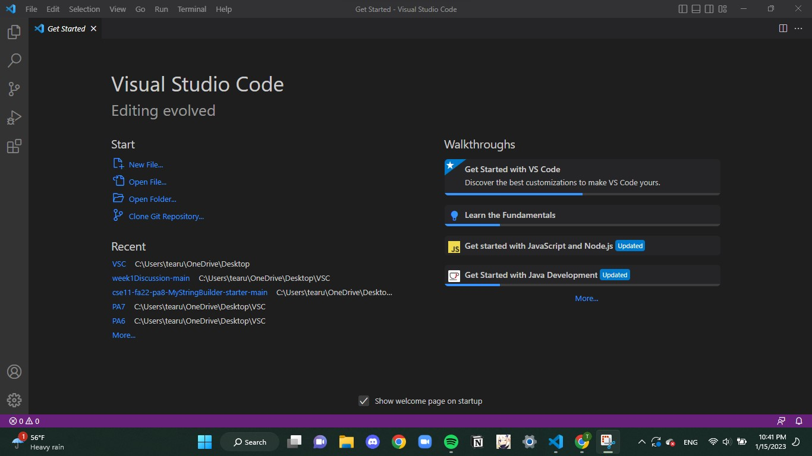
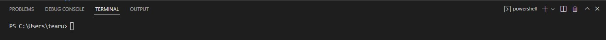
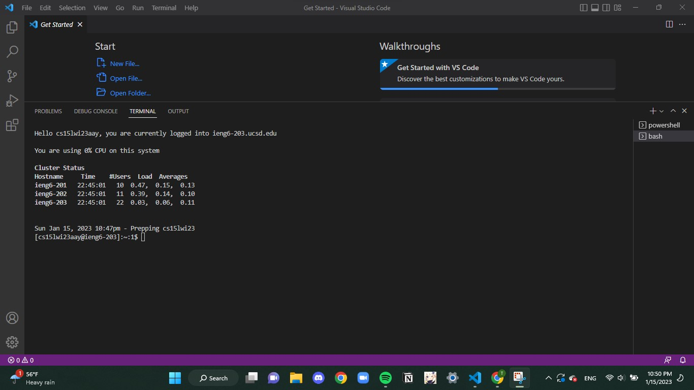
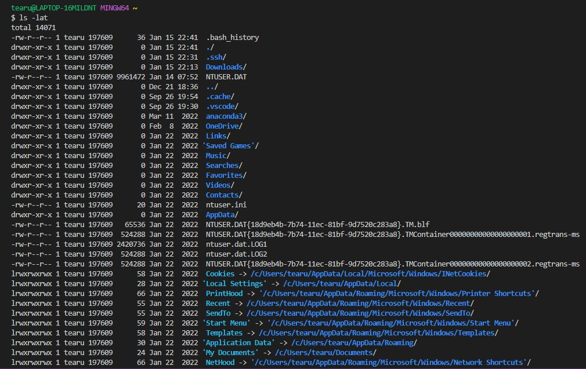
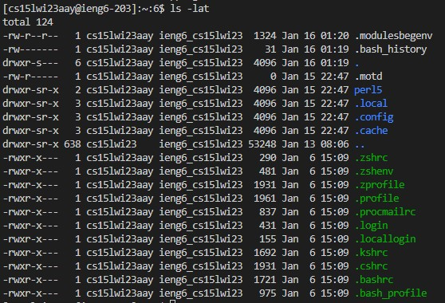

# How To Log Into Course-Specific Account on ieng6
## Access CSE15L Account 
  Each student has a course-specified account starting with: **cs15lwi23**
  
  Ex: cs15lwi23aaa
  
  I accessed my account using [https://sdacs.ucsd.edu/~icc/index.php](url)
  
## Install Visual Studio Code
I already had VSC downloaded on my computer but the steps are listed below if needed. 

* To install Visual Studio Code visit [https://code.visualstudio.com/](url)
* Download the version for your operating system (macOS or Windows)
* Once installed, open a window. It should look like the photo below:
  

## Remotely Connecting 
***NOTE***: I use Windows and had to install **git** for Windows which can be done here: [https://gitforwindows.org/](url)

### Using git bash 
* With Visual Studio Code open, I used **CTRL** + **`**  to open terminal
* Once in terminal tab I changed it from powershell to git bash by clicking on the down arrow

### Open Terminal in VScode
* If in git bash, a $ should be visible 
* I input the following command, using my CSE15L Account: 
 `ssh cs15lwi23aay@ieng6.ucsd.edu`
* If it is your first time accessing the server so you may get a message starting with " The authenticity of host 'ieng6.ucsd.edu'..." asking if you want to continue.
* Type **yes**
* The terminal asked for my password, I gave the password for my CSE15L account. ***NOTE***: It will not look like anything is typing but it is.
* I knew it had worked when the following output was given:
 
 
 ## Trying Commands
 For this step I work with two different terminals
 
 I ran commands on my computer(opened new terminal) and the remote computer(using the ssh terminal from the step above)
 ### Using **ls -lat** command 
My computer resulted in the following:

The remote computer resulted in:

The ls command gives the list of files and directories and we see how these two computer above differ in what is stored.
### Other Commands
I also used:
* `cd`: this command changes directory
* `cd ~`: this command allows us to move between directories
* `ls -a`: this command lists all files, including those hidden
* `cp /home/lineux/ieng6/cs15wi23/public/hello.txt ~/` : this command copies files to a directory
* and more
### Exiting Remote Server
To log out of remote server I ran the command 'exit' and received a message saying the connection for ieng6.ucsd.edu was closed. 
 
